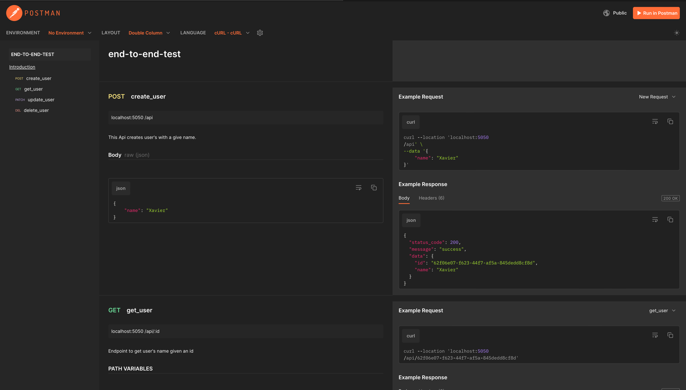
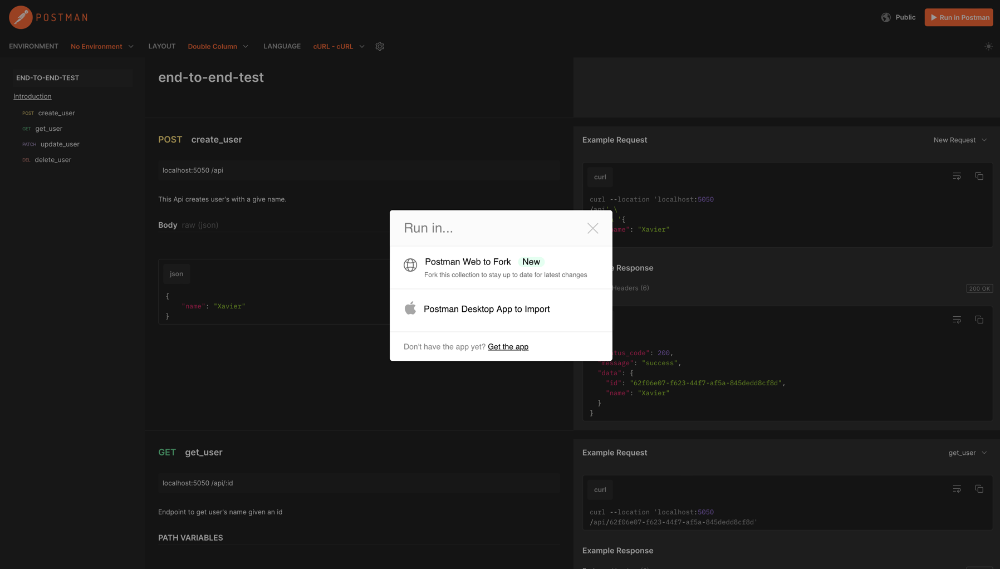
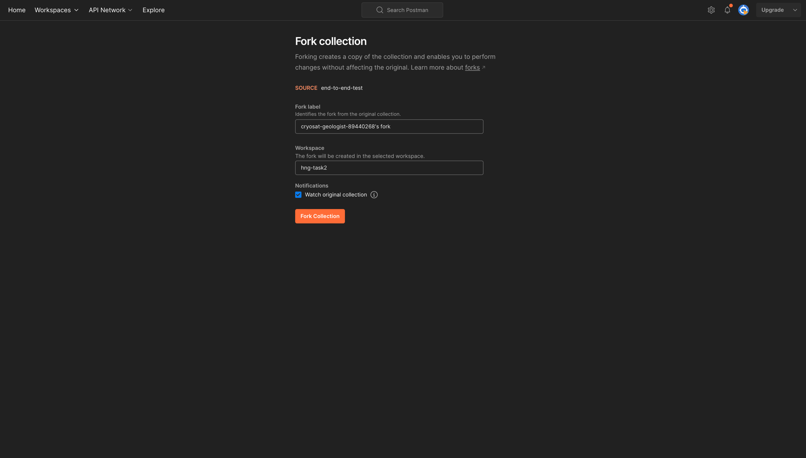
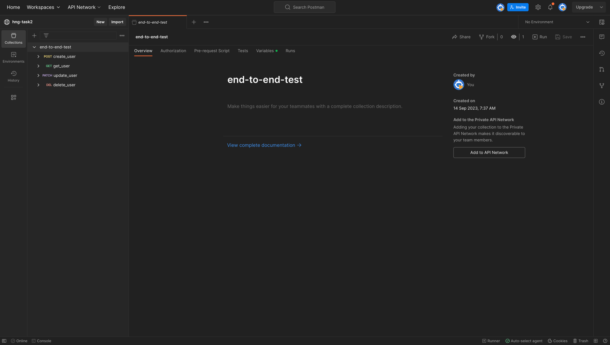
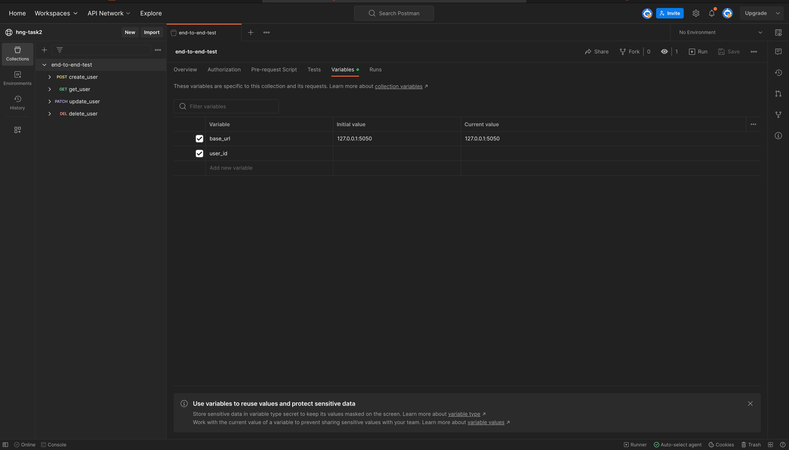
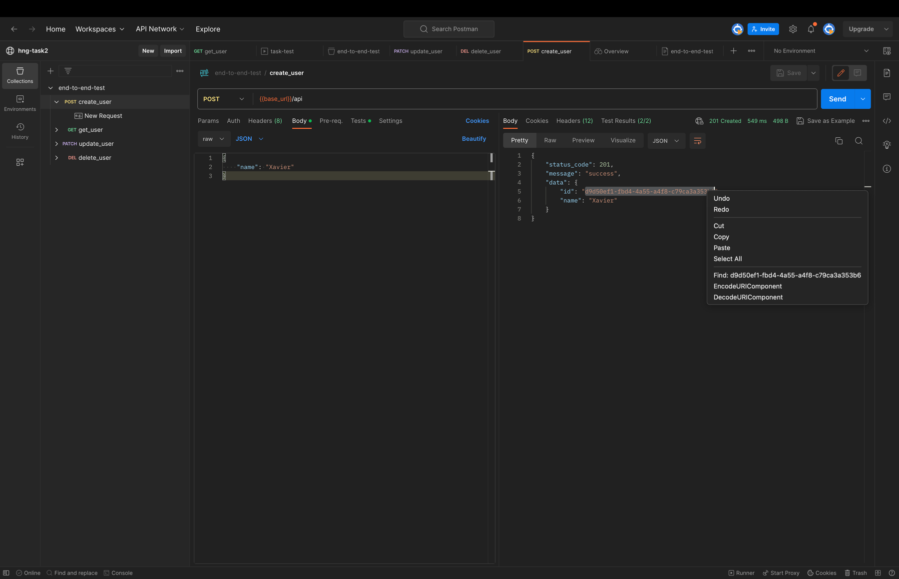
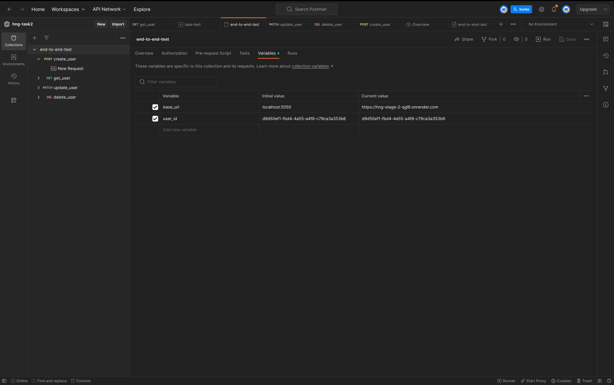
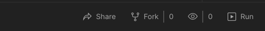
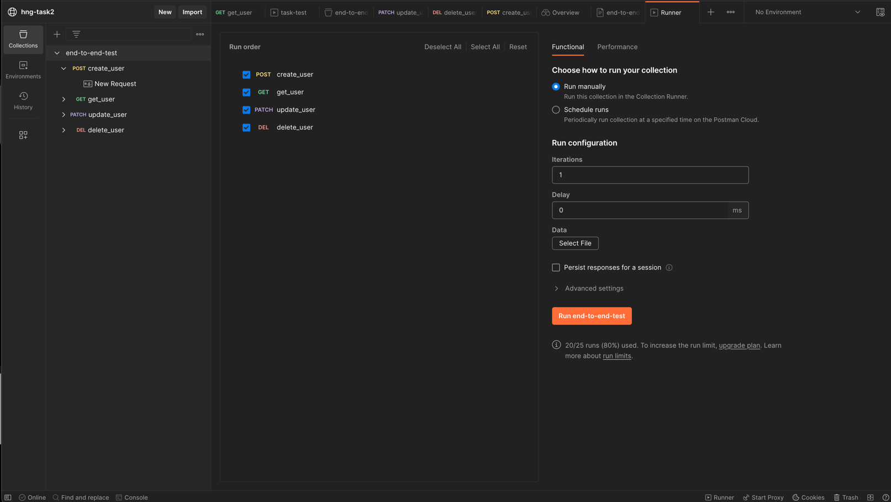
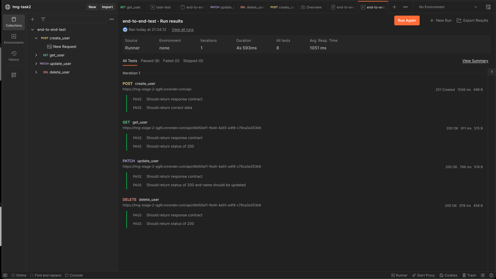

# Getting started

This task was completed using Golang's fiber framework and Postgresql as the database.

## Running the Server

### Tidy dependencies

```shell
$ go mod tidy
```

### Starting the server

```shell
$ go run main.go
```

## Folder structure
```shell
.
├── DOCUMENTATION.md
├── LICENSE
├── README.md
├── config
│   └── env
│       └── env.go
├── database
│   └── postgres
│       └── postgres.go
├── dbconf.yml
├── go.mod
├── go.sum
├── main.go
├── migrations
│   └── 20230914210832_dbinit.sql
├── pkg
│   ├── dtos
│   │   └── response_body.go
│   ├── middlewares
│   │   ├── global_error_handler.go
│   │   └── request_body_validator_middleware.go
│   ├── types
│   │   └── number.go
│   └── utils
├── screenshots
│   ├── img.png
│   ├── img_1.png
│   ├── img_10.png
│   ├── img_2.png
│   ├── img_3.png
│   ├── img_4.png
│   ├── img_5.png
│   ├── img_6.png
│   ├── img_7.png
│   ├── img_8.png
│   └── img_9.png
└── users
    ├── dtos.go
    ├── entity.go
    ├── handler.go
    └── route.go

13 directories, 29 files


```

### Folders and file to take note of

- [migrations](./migrations): contains migrations for the postgres ([Goose](https://bitbucket.org/liamstask/goose/src/master) was used to generate and run the migration files but the migrations are handwritten)
- [dbconf.yml](./dbconf.yml): config file for goose

## Generate swagger docs with [Swag](https://github.com/swaggo/swag)

To generate swagger docs for your APIs with swag, run:

```shell
$ swag init -g main.go
```

## Migrations with [Goose](https://bitbucket.org/liamstask/goose/src/master)

### Creating Migrations

You can create migrations in either go or sql. SQL is preferred in this project.
To generate migrations with in SQL with [goose](https://bitbucket.org/liamstask/goose/src/master), run:

```shell
$ goose -path . create <your-migration-name>
```

### Running up migrations

```shell
$ goose -path . -env <environment> up # (check dbconf.yml to see configured environments)
```

### Running down migrations

```shell
$ goose -path . -env <environment> down # (check dbconf.yml to see configured environments)
```


# Testing (postman)
### Forking published collection

> See Api documentation [here](https://documenter.getpostman.com/view/14340631/2s9YC4WZV4).



> Click "Run in postman"



> Give the fork a label then click  "Fork Collection"





> If you are running locally, run the server and enter the baseurl. If not use the deployed url (https://hng-stage-2-qgl6.onrender.com)



> Create a user with a name and copy the id into the `user_id` variable. (Do make sure to save changes)






### Running test

>Click "run"



> "Run end-to-end test"

 

> See test as they are being executed




