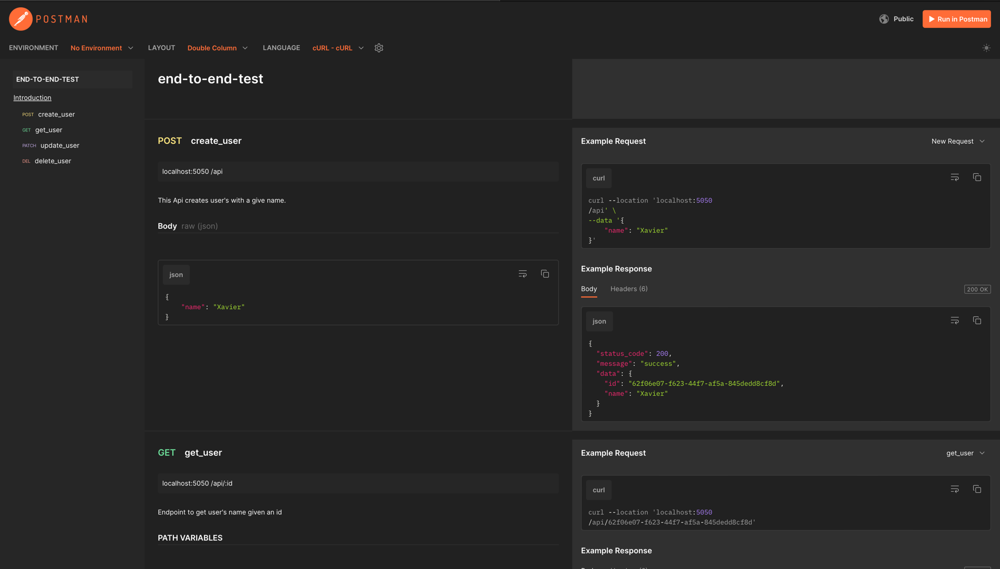
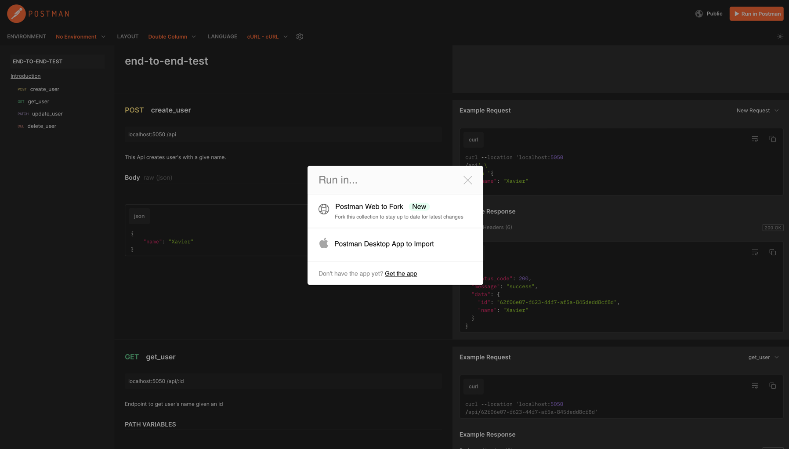
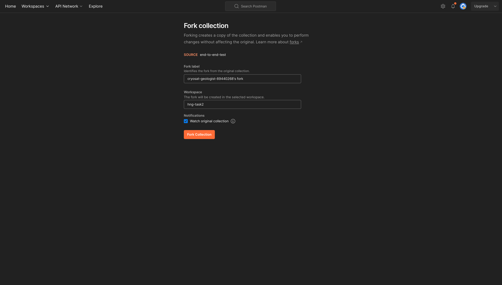
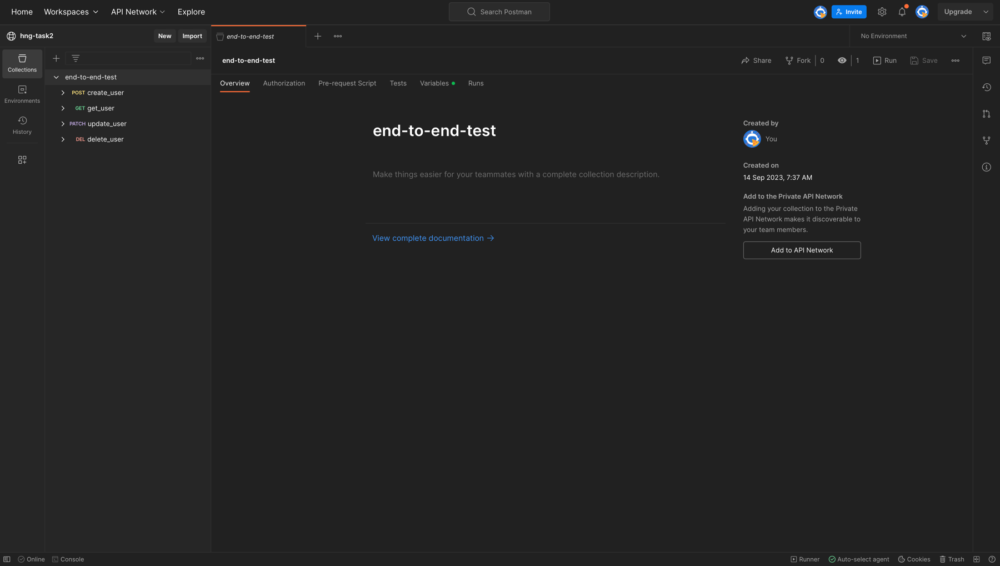
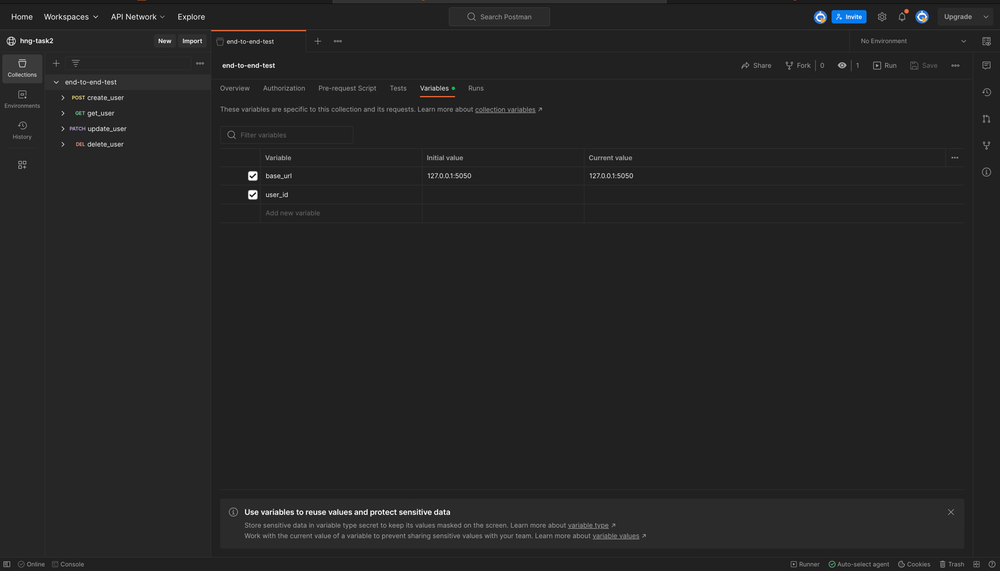

[//]: # (# Fiber App)

[//]: # ()
[//]: # (This is a project starter for [fiber]&#40;https://docs.gofiber.io/&#41; apps)

[//]: # ()
[//]: # (# How to use this template)

[//]: # (This you can use the [temaple button]&#40;https://github.com/new?template_name=fiber-boilerplate&template_owner=Xavier577&#41; to create a new repo or you can use degit.)

[//]: # ()
[//]: # (```shell)

[//]: # ($ npx degit https://github.com/Xavier577/fiber-boilerplate.git <project-name>)

[//]: # (```)

[//]: # ()
[//]: # (## Running the Server)

[//]: # ()
[//]: # (### Tidy dependencies)

[//]: # ()
[//]: # (```shell)

[//]: # ($ go mod tidy)

[//]: # (```)

[//]: # ()
[//]: # (### Starting the server)

[//]: # ()
[//]: # (```shell)

[//]: # ($ go run main.go)

[//]: # (```)

[//]: # ()
[//]: # (## Folder structure)

[//]: # (```shell)

[//]: # (.)

[//]: # (├── LICENSE)

[//]: # (├── README.md)

[//]: # (├── config)

[//]: # (│   └── env)

[//]: # (│       └── env.go)

[//]: # (├── dbconf.yml)

[//]: # (├── docs)

[//]: # (│   ├── docs.go)

[//]: # (│   ├── swagger.json)

[//]: # (│   └── swagger.yaml)

[//]: # (├── go.mod)

[//]: # (├── go.sum)

[//]: # (├── main.go)

[//]: # (├── migrations)

[//]: # (│   └── 20230809154912_dbinit.sql)

[//]: # (├── pkg)

[//]: # (│   └── number)

[//]: # (│       └── number.go)

[//]: # (└── users)

[//]: # (    ├── handler.go)

[//]: # (    └── route.go)

[//]: # ()
[//]: # (```)

[//]: # ()
[//]: # (### Folders and file to take note of)

[//]: # ()
[//]: # (- [docs]&#40;./docs&#41;: generated by [swag]&#40;https://github.com/swaggo/swag&#41; for api documentation)

[//]: # (- [migrations]&#40;./migrations&#41;: contains migrations for the postgres &#40;[Goose]&#40;https://bitbucket.org/liamstask/goose/src/master&#41; was used to generate and run the migration files but the migrations are handwritten&#41;)

[//]: # (- [dbconf.yml]&#40;./dbconf.yml&#41;: config file for goose)

[//]: # ()
[//]: # (## Generate swagger docs with [Swag]&#40;https://github.com/swaggo/swag&#41;)

[//]: # ()
[//]: # (To generate swagger docs for your APIs with swag, run:)

[//]: # ()
[//]: # (```shell)

[//]: # ($ swag init -g main.go)

[//]: # (```)

[//]: # ()
[//]: # (## Migrations with [Goose]&#40;https://bitbucket.org/liamstask/goose/src/master&#41;)

[//]: # ()
[//]: # (### Creating Migrations)

[//]: # ()
[//]: # (You can create migrations in either go or sql. SQL is preferred in this project.)

[//]: # (To generate migrations with in SQL with [goose]&#40;https://bitbucket.org/liamstask/goose/src/master&#41;, run:)

[//]: # ()
[//]: # (```shell)

[//]: # ($ goose -path . create <your-migration-name>)

[//]: # (```)

[//]: # ()
[//]: # (### Running up migrations)

[//]: # ()
[//]: # (```shell)

[//]: # ($ goose -path . up -env <environment> # &#40;check dbconf.yml to see configured environments&#41;)

[//]: # (```)

[//]: # ()
[//]: # (### Running down migrations)

[//]: # ()
[//]: # (```shell)

[//]: # ($ goose -path . down -env <environment> # &#40;check dbconf.yml to see configured environments&#41;)

[//]: # (```)

# Getting started

This task was completed using Golang's fiber framework and Postgresql as the database.


# Testing (postman)
### Forking published collection

> Go to the published documentation [here](https://documenter.getpostman.com/view/14340631/2s9YC4WZV4).



> Click "Run in postman"



> Give the fork a label then click  "Fork Collection"





> If you are running locally, run the server and enter the baseurl. If not use the deployed url



> Create a user with a name and copy the id into the `user_id` variable


